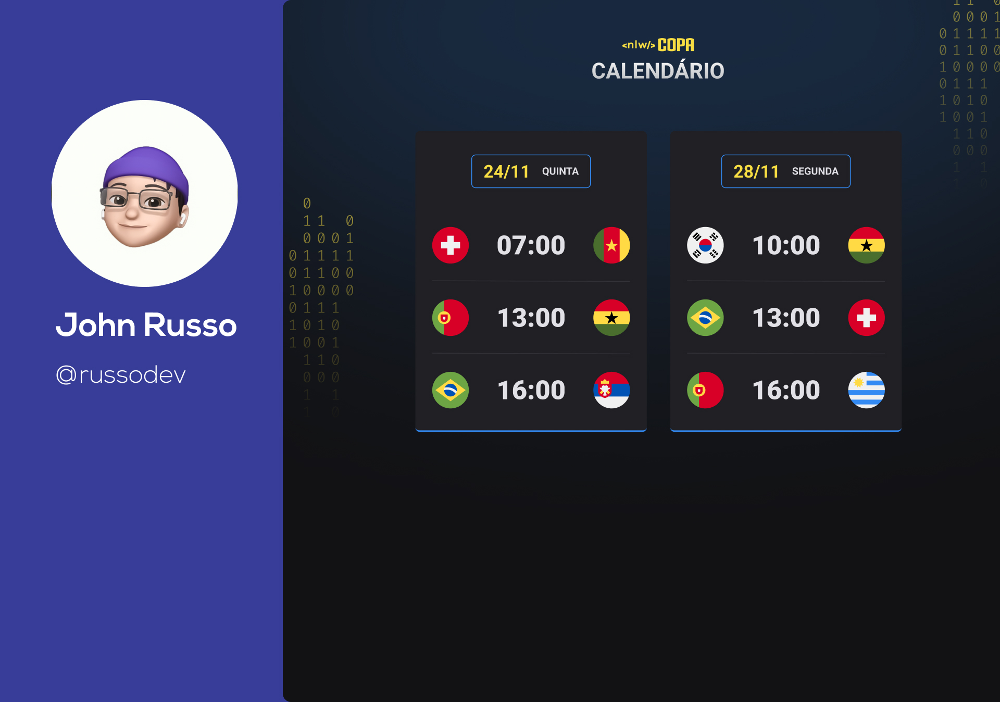

<h1 align="center"> NLW # World 2022 Cup </h1>

Exclusive, free event promoted by Rocketseat for teaching WEB technologies.

  <a href="#-tecnologias">Tecnologies</a>&nbsp;&nbsp;&nbsp;|&nbsp;&nbsp;&nbsp;
  <a href="#-projeto">Project</a>&nbsp;&nbsp;&nbsp;|&nbsp;&nbsp;&nbsp;
  <a href="#-layout">Layout</a>&nbsp;&nbsp;&nbsp;|&nbsp;&nbsp;&nbsp;
  <a href="#memo-licença">License</a>

  

 

  

## 🚀 Tecnologies

This project was developed with:

- HTML e CSS
- JavaScript
- Git & GitHub
- Figma

## 💻 Project

This project was conceived with the objective of scheduling the games for the 2022 World Cup. 

## 🔖 Layout

You can view the project layout through [DESSE LINK](https://www.figma.com/community/file/1169028052212317700). You must have an account at [Figma](https://figma.com) for access.

## :memo: Licence

This project is under the MIT license.

---

